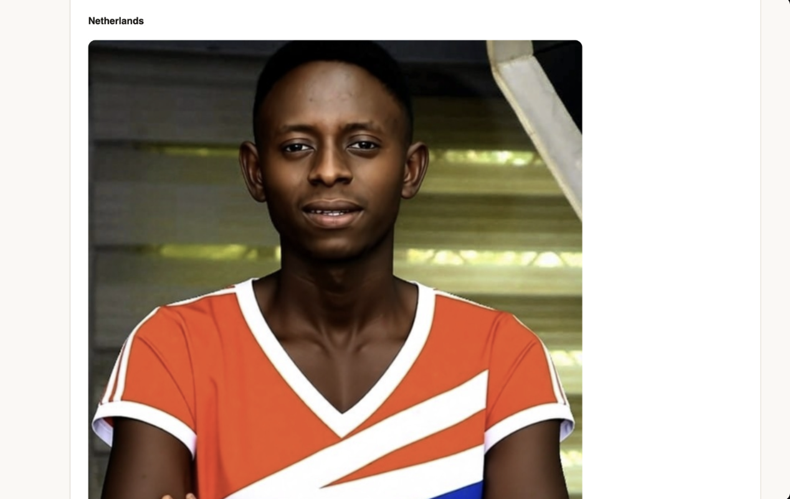

# Undertone

**Your face decides your palette. Your palette decides what's worth trying on.**

Undertone measures the colour of your skin, hair and eyes, works out which
seasonal palette you belong to, scores a garment catalogue against that palette
with a perceptual colour-difference metric, and then shows you the best matches
on your own photo.

Built for the YouCam AI Hackathon on the **AI Skin Analysis + Apparel VTO**
combined track.

```
selfie ──► Skin Tone Analysis ──► seasonal colour profile
                                        │
                                        ▼
                                garment catalogue scored by
                                CIEDE2000 against the palette
                                        │
                                        ▼
photo ──────────────────────────► Apparel VTO on the top matches
```

The join is the point. Tone analysis decides *which* garments are worth trying
on; VTO proves the call. Neither API is decorative, and neither could produce
the result alone.

| Before | After |
|---|---|
|  |  |

The original photo is royal blue — the single worst-scoring colour in the
catalogue for this face, ΔE 35 from anything in the palette. The replacement was
chosen because its ΔE to the palette was small, not because it looked nice in a
thumbnail.


---

## What it actually does

Ask someone why a colour suits them and you get vibes. Undertone answers with
measurements.

| Axis | Measured as | Example |
|---|---|---|
| Undertone | CIELAB hue angle `h_ab = atan2(b*, a*)` | warm, 61° |
| Depth | CIELAB `L*` | deep, L* 33 |
| Contrast | ΔL* between skin and hair | low, ΔL* 4.5 |
| Chroma | mean feature saturation | soft |

Those four axes place you in a season, which carries a palette. Every garment
is then scored by its CIEDE2000 distance to the nearest palette colour, and
every verdict shows its working:

```
 1. Glitter Glam Gown   #ecddce   91.1  excellent  Almost exactly your Cream (ΔE 4)
 4. Croatia             #da0617   76.2  excellent  Almost exactly your Rust (ΔE 10)
10. Netherlands         #fd5f0c   68.6  good       Close to your Clay (ΔE 13)
16. Cloud Ruffle        #e4e4e4   36.6  clashes    ΔE 12 from an avoid-tone
20. France              #08369a   16.5  poor       Closest is Deep bark, ΔE 35
```

---

## Three decisions worth explaining

### 1. Hue angle, not raw a*/b* — so it works on every skin tone

The obvious way to detect warm vs cool undertone is to threshold the CIELAB
`b*` (yellow–blue) and `a*` (green–red) values. It's also wrong.

Those magnitudes scale with lightness. Thresholds tuned on mid-light skin
collapse toward zero on deep skin, so the reading comes back "neutral" — not
because the undertone is ambiguous, but because the sample is darker. A first
pass at this scored deep brown skin at `+0.04`, effectively a shrug.

The hue **angle** `atan2(b*, a*)` measures the *direction* of the colour in the
a*/b* plane rather than its magnitude, so it's lightness-invariant. Human skin
lands between roughly 35° and 75° regardless of depth. One threshold is valid
across the whole tonal range.

The same face now reads `warm, 61°`, and deep skin with black hair classifies
at 0.94 confidence instead of 0.54.

On an API whose stated purpose includes inclusivity across ethnicities, an
analysis layer calibrated only for light skin would undercut the entire product.

### 2. The detector's output is validated, not trusted

Run a passport photo through the tone analyzer and you may get:

```json
{"skin_color": "#624836", "hair_color": "#FAF0BE", "hair_color_name": "Blonde"}
```

`#FAF0BE` is pale cream. On deep brown skin, that isn't hair — it's the white
backdrop bleeding into the hair sampling region.

Undertone detects this (`L* > 82` and `C* < 30`), says so in the UI, and falls
back to `eyebrow_color` for the contrast axis. Eyebrows track hair depth closely
and sit inside the face region, so the background can't leak in. The stated
confidence drops to reflect the degraded input.

Contrast on that photo went from a fictitious ΔL* 62 to a real ΔL* 4.5.

### 3. CIEDE2000, not RGB distance

Euclidean RGB distance treats a 20-point shift in dark navy as equivalent to 20
points in bright yellow. The eye does not. CIEDE2000 corrects for lightness,
chroma and hue-dependent sensitivity — which is precisely what "does this colour
suit me" depends on. Implemented from the CIE specification in `match.py`, no
dependencies.

---

## Running it

```bash
git clone <your-repo-url> && cd undertone
python3 -m venv .venv && source .venv/bin/activate
pip install -r requirements.txt

echo 'YOUCAM_API_KEY=your_key_here' > .env    # from the YouCam API console
uvicorn server:app --reload
```

Open <http://127.0.0.1:8000>.

### Demo mode — explore without spending units

```bash
UNDERTONE_DEMO=1 uvicorn server:app --reload
```

Serves a cached profile, ignores uploads, blocks try-on. The whole interface can
be developed and reviewed without consuming a single API unit.

### CLI

```bash
python undertone.py analyse Pass.jpg                          # 1 unit, caches profile.json
python undertone.py match Pass.jpg --catalogue garments_youcam.csv   # free
python undertone.py tryon Pass.jpg --body full.jpg --top 2    # 1 unit per garment
python catalogue.py --debug                                    # rebuild catalogue, free
```

---

## Layout

| File | Role |
|---|---|
| `colour.py` | Colour space conversion, seasonal analysis, palettes. Stdlib only. |
| `match.py` | CIEDE2000 and garment scoring. Stdlib only. |
| `youcam_client.py` | Async YouCam driver — upload, task, poll, unit budget. |
| `catalogue.py` | Builds a colour-matchable catalogue from YouCam's templates. |
| `server.py` | FastAPI backend. |
| `static/index.html` | Single-page frontend. |
| `undertone.py` | CLI. |

`colour.py` and `match.py` have no third-party dependencies and no YouCam
coupling — they're reusable for any colour-analysis work.

---

## Notes for anyone integrating the YouCam API

Things that cost time and aren't obvious from the documentation:

**Calling the File API does not upload the file.** You get a presigned URL back
and must `PUT` to it yourself. Skip that and task creation fails later with an
unrelated-looking 500.

**Don't send your API key to the presigned URL.** S3 rejects it —
`InvalidArgument: Only one auth mechanism allowed` — and it would leak your
credential to a third party. Use a client with no default headers for that PUT.

**Polling is mandatory.** A task that completes but is never polled expires,
returns `InvalidTaskId`, and still charges your units.

**Units are billed on success only.** Failed tasks are free, so iterating on
photo framing is cheap.

**`template_id` is documented but not accepted.** The AI Clothes guide lists
`ref_file_id`, `ref_file_url` or `template_id` as garment sources. Both `cloth`
and `cloth-v3` reject payloads carrying `template_id`, with a misleading
`InvalidParameters: missing required properties (["src_file_url"])` — a `oneOf`
failure listing every branch it didn't match. Use the template's `thumb` URL as
`ref_file_url` instead.

**`ui_score` is deliberately inflated.** The Skin Analysis docs state the raw
scores are adjusted upward because "consumers generally prefer positive
evaluations". Anything tracking change over time must use `raw_score`, or
genuine progress gets flattered away.

---

## Limitations

- Seasonal colour analysis is a four-season model. Practitioners use twelve;
  the extra granularity mostly refines chroma and depth within a season.
- The catalogue's 20 garment colours are hand-verified. `catalogue.py` extracts
  them from thumbnails automatically, but worn-garment photos on models are hard
  to sample reliably — layouts vary and skin is a large coherent region that
  quantisation happily returns as dominant. It learns each model's skin from the
  face band and subtracts it, which helps but isn't perfect. Production
  integrations would read colour from product metadata.
- Try-on quality depends on pose. Standing, forward-facing, shoulders visible.

---

## Licence

MIT
